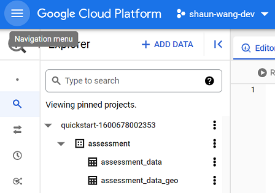

# This is a private repo for hosting my answers to [assessment](assessment.md)

- `'` is preferred to `"`
- `snake_case` is prefer to `camelCase`

## Dev environment
- Location: local pc i.e. local installation of Python
- OS: Windows 11 (21H2)
- Python verion: 3.10.4 (non-conda)
- Git version: 2.36.1.windows.1
- IDE: VS code
- Packages: [requirements.txt](requirements.txt)
- Complete tree view of dev directory: [tree.txt](tree.txt)

## Assessment ipynb notebook
[exam_paper.ipynb](exam_paper.ipynb)

## Virtual environment
./venv/Scripts/python.exe

## Database

## Data ingestion

```mermaid
graph TD
    A[Jupyter notebook] --> B1(Bigquery API)
    A -->|Export data in csv file| B2[Cloud storage API]
    B2 --> C2{File exists?}
    C2 -->|Yes| D2[Delete file]
    C2 -->|Yes| E2[Upload file]
    E2 -->|Staging| F2[Cloud storage bucket]
    F2 --> G1
        
    B1 --> C1{Table exists?}
    C1 -->|Yes| D1[Delete table]
    C1 -->|No| E1[Create table] --> F1[Bigquery tranfer]
    F1 --> G1[Create tranfer config]
    G1 -->|Python triggers transfer| H1[Data transferred from cloud storage bucket to bigquery table]
    H1 -->|Data studio data connection| I1[Data studio dashboard]
```

  
